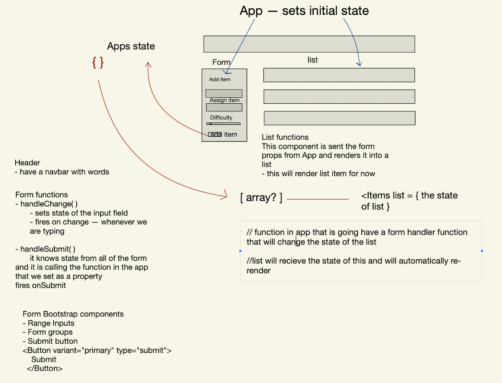
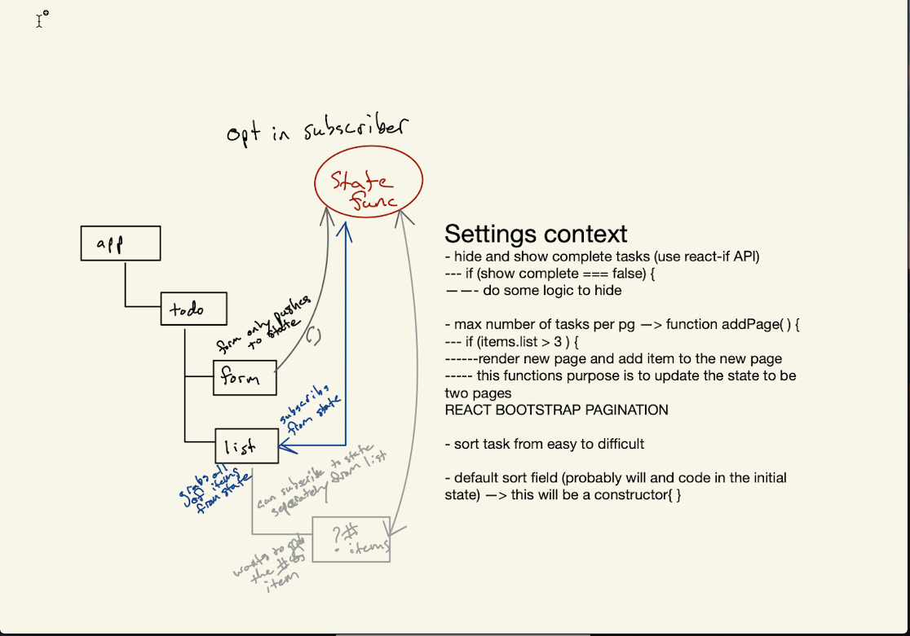

# To Do List Manager
## Author: Edgar Romero, Chris Bortel
### Links and Resources
- [Netlify Deployment](https://5fbaee2f6f4ad000083c8bb1--nostalgic-mahavira-2ef425.netlify.app/)
- Class-31 [Pull Request](https://github.com/Chris-Bortel-401-advanced-javascript/todo-list-app/pull/1)
- Class-33 [Pull Request](https://github.com/Chris-Bortel-401-advanced-javascript/todo-list-app/pull/9)
- Class-34 [Pull Request](https://github.com/Chris-Bortel-401-advanced-javascript/todo-list-app/pull/11)
- ci/cd (GitHub Actions)
- back-end server url (when applicable)
- front-end application (when applicable)

<br>

 #### [Phase 1 Requirements](docs/phase1.md)
 #### [Phase 2 Requirements](docs/phase2.md)
 #### [Phase 3 Requirements](docs/phase3.md)
 #### [Phase 4 Requirements](docs/phase4.md)
 #### [Business and Technical Requirements](docs/business-tech-requirements.md)
 
<br>

## Setup
To initialize as an npm project, run the following command:
<br>

- `git clone https://github.com/Chris-Bortel-401-advanced-javascript/todo-list-app.git`


- `npm install`

Dependencies: 
```
 "dependencies": {
    "@testing-library/jest-dom": "^5.11.6",
    "@testing-library/react": "^11.2.0",
    "@testing-library/user-event": "^12.2.2",
    "bootstrap": "^4.5.3",
    "node-sass": "^4.14.1",
    "react": "^17.0.1",
    "react-bootstrap": "^1.4.0",
    "react-dom": "^17.0.1",
    "react-scripts": "4.0.0",
    "web-vitals": "^0.2.4"
  }
```


## How to initialize/run your application (where applicable)
TO RUN THE APPLICATION--
In the Terminal(s) run: `npm start `


## Tests
Tests are handled with the jest testing library. Install jest to the dev dependencies. Follow the command:
`npm i --save-dev jest`

<br>

## UML




